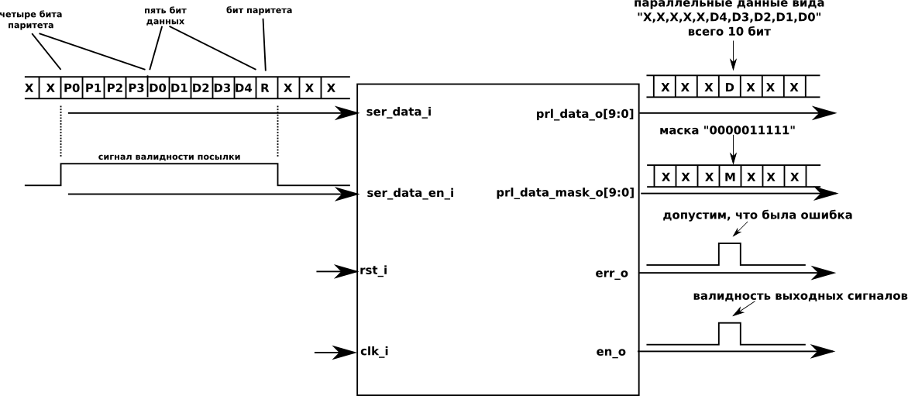

# Задание
Устройство для реализации – десериализатор. 
На его вход поступают посылки данных в последовательном виде, а с выхода они забираются в параллельном виде. 
Структура последовательной посылки: 4 бита преамбулы (служебные биты), 2-10 бита данных, 1 бит паритета 
(результат операции XOR между всеми битами данных; нужен для проверки целостности данных на приеме). 
Т.е. общая длина посылки 7-15 бит.

## Интерфейс устройства
### Входы
1. `rst_i` – сигнал асинхронного сброса (reset); нужен для возвращения устройства в исходное состояние.
2. `clk_i` – синхросигнал, по которому работает модуль.
3. `ser_data_i` – вход последовательных данных
4. `ser_data_en_i` – вход валидности последовательных данных. Если на линии `ser_data_i` присутствует валидный бит посылки, то `ser_data_en_i` равен единице. Т.е. данный сигнал информирует устройство о наличии и длительности последовательной посылки.

### Выходы
1. `prl_data_o[9:0]` – выход параллельных данных. На этом выходе появляются от 2-х до 10-ти бит данных.
2. `prl_data_mask_o[9:0]` – маска для выходных параллельных данных. Она необходима для того, чтобы понять сколько бит данных на выходе `prl_data_o` валидно. Т.к. количество  бит данных может быть разным (от 2-х до 10-ти), то с помощью маски необходимо отметить (единицей) валидные биты. Например, если мы приняли 4 бита данных, то маска будет выглядеть следующим образом: `0000001111`.
3. `err_o` – выход, который сообщает о результате проверки паритета или преамбулы в посылке. Т.е. необходимо у принятых данных посчитать бит паритета и сравнить его с битом паритета, который мы приняли в посылке. Если они не совпали – значит данные повреждены и на выходе `err_o` возникает единичный уровень. Кроме того, данный сигнал устанавливается, если преамбула содержит ошибку.
4. `en_o` – единичный импульс (т.е. равен единице на протяжении одного такта синхросигнала). Данный сигнал подтверждает валидность выходов `prl_data_o`, `prl_data_mask_o`, `err_o`.

## Дополнение
Конкретное значение преамбулы должно задаваться параметром. 
Устройство необходимо просимулировать и получить временные диаграммы. 

## Пример работы устройства на рисунке

